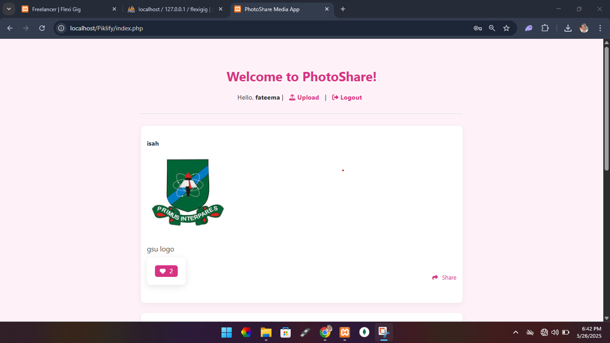
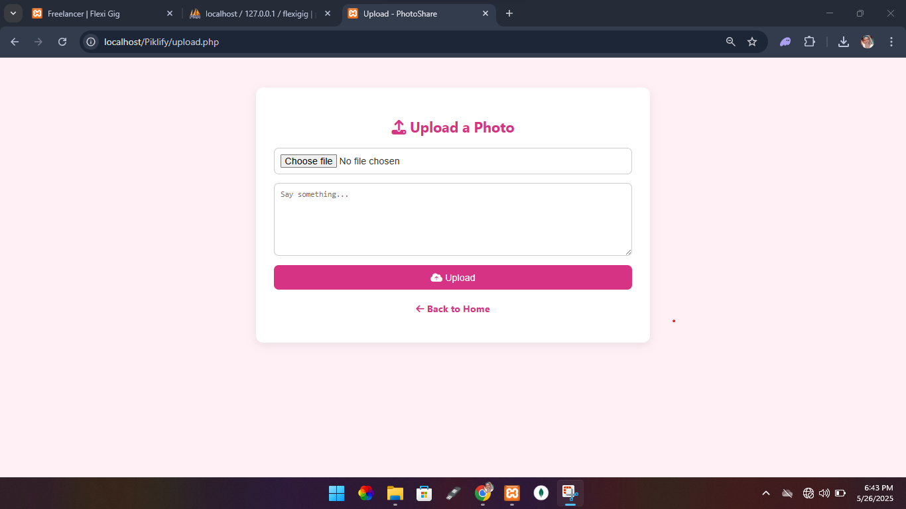
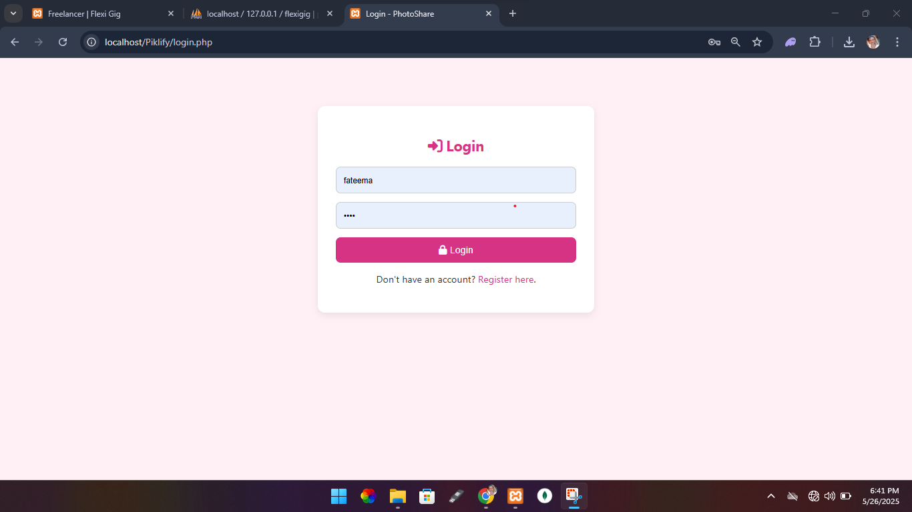

# 📸 PhotoShare Media App

PhotoShare is a simple and elegant photo-sharing web application built with **PHP**, **MySQL**, **HTML**, and **vanilla CSS**. It allows users to upload, view, like, and share images on a social-style platform.

## 🌟 Features

- User authentication (Register & Login)
- Upload and share images with captions
- View a public feed of all posts
- Like and share posts
- Responsive and stylish UI with pink/magenta-themed colors

## 🖼️ Screenshots

### Homepage


### Upload Page


### Login Page


## 🚀 Getting Started

### Prerequisites

- PHP >= 7.4
- MySQL
- Apache Server or XAMPP/WAMP
- Web browser

### Installation

1. **Clone the repository**
   ```bash
   git clone https://github.com/yourusername/photoshare.git
   cd photoshare
   ```

2. **Create a MySQL database** and import the `database.sql` file in the `includes/` directory.

3. **Configure your database connection**
   - Edit the `includes/db.php` file with your database credentials:
     ```php
     $conn = mysqli_connect('localhost', 'root', '', 'photoshare');
     ```

4. **Start your PHP server**
   ```bash
   php -S localhost:8000
   ```

5. **Visit** `http://localhost:8000` in your browser.

## 🧱 Folder Structure

```
photoshare/
│
├── css/
│   └── style.css
├── images/
│   └── homepage.png, upload.png, ...
├── includes/
│   └── db.php
├── uploads/
│   └── (Uploaded images)
├── index.php
├── login.php
├── logout.php
├── register.php
├── upload.php
├── share.php
└── README.md
```

## 👤 Author

- **Name:** Isah Abdulhameed Haruna
- **Email:** isahceekeey@gmail.com

## 📜 License

This project is open-source and available under the [MIT License](LICENSE).
